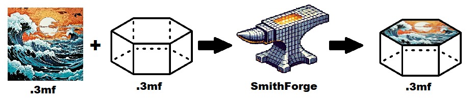

<p align="center">
  
</p>

A tool for combining two 3MF models by overlaying a Hueforge model onto a base shape model with automatic scaling, positioning, and proper model intersection. The output 3MF file can then be opened with your favorite slicer to be sliced and be sent to a 3D printer! 

This script was initially written to easily embed existing HueForge models on top of ChromaLink hexagon bases. (TODO: Insert link)

## Features
- Automatic scaling of X & Y axis to match the base dimensions while maintaining aspect ratio.
- The Z-axis scaling remains unchanged throughout the process to avoid disrupting the Hueforge model's visual integrity.
- Also maintains model integrity through convex hull clipping
- Automatic centering
- Custom X/Y/Z positioning
- Proper model intersection and union
- Smart Z-axis embedding with configurable overlap
- Base model rotation support

## Technical Process
<p align="center">
  
</p>

1. Loads both 3MF models
2. Optionally rotates base model
3. Calculates and applies scaling to match base dimensions
4. Centers Hueforge on base model
5. Embeds Hueforge with slight Z overlap
6. Applies user-specified position adjustments
7. Creates convex hull of base for proper intersection
8. Performs boolean operations for clean combination
9. Exports final unified model

## Notes
- Default overlap is 0.2mm for proper model union
- Scale maintains aspect ratio in X/Y dimensions
- Z-axis height is never modified (as per HueForge guidelines)
- Models must have proper manifold geometry

## Future Features
- Add height modifiers and filament colours from HueForge description files in the 3MF output

## Requirements
- Python 3.x
- trimesh
- shapely
- A base model (.3mf)
- A model to be embedded like a HueForge (.3mf)

## Installation
```bash
pip install trimesh shapely
```

## Usage
```bash
python put_3mf_on_3mf.py -f hueforge.3mf -b base.3mf [options]
```

### Parameters
#### File paths
```bash
-f, --hueforge: Path of the 3MF file that will serve as the overlay to be embedded to the base (required)
-b, --base: Path of the base shape 3MF file (required)
-o, --output: Output file path (default: combined.3mf)
```

#### Overlay geometry
```bash
--xshift: X-axis shift in mm
--yshift: Y-axis shift in mm
--zshift: Z-axis shift in mm
-s, --scale: Force specific scale value
--scaledown: Allow downscaling below 1.0
```

#### Base geometry
```bash
--rotatebase: Rotate base model (degrees, 0-360)
```

### Examples
Basic combination:
```bash
python put_3mf_on_3mf.py -f design.3mf -b base.3mf
```

Rotate base and adjust position of HueForge (in mm):
```bash
python put_3mf_on_3mf.py -f design.3mf -b base.3mf --rotatebase 90 --xshift 5 --zshift 0.5
```

Force a user defined scale for the HueForge model (example: 1.5x size)
```bash
python put_3mf_on_3mf.py -f design.3mf -b base.3mf -s 1.5
```